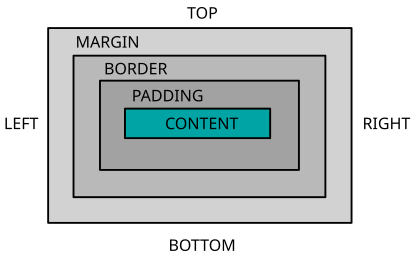

# Chapter 3: HTML and CSS for Web Developers

## Understanding HTML

### What is HTML?

HTML, an acronym for HyperText Markup Language, is the standard markup language for documents designed to be displayed in a web browser. It is the backbone of any web page, essentially serving as the skeleton that gives every webpage structure.

HTML consists of a series of elements, which you use to enclose or wrap different parts of the content to make it appear or act a certain way. The enclosing tags can make a word or image hyperlink to somewhere else, can italicize words, can make the font bigger or smaller, and so on.

For example, to make a paragraph in HTML, you could wrap the text 'Hello, World!' in a `<p>` (short for paragraph) element like so:

```html
<p>Hello, World!</p>
```

When viewed in a web browser, this HTML snippet would simply display the text `Hello, World!` with a little bit of space above and below the sentence, the default styling browsers apply to paragraphs.

### Basic Structure of an HTML Document

Every HTML document has a specific structure including certain tags that encapsulate different parts of the document. Here's the basic structure of an HTML5 document:

```html
<!DOCTYPE html>
<html>
    <head>
        <title>Page Title</title>
    </head>
    <body>
        <h1>My First Heading</h1>
        <p>My first paragraph.</p>
    </body>
</html>
```

* **`<!DOCTYPE html>`**: This declaration helps the browser to display a page correctly, according to the version of HTML used in the page.
* **`<html>`**: This is the root element of an HTML page.
* **`<head>`**: This contains meta-information about the document, including a required title for the page, which is shown in the title bar or tab of most browsers.
* **`<title>`**: This sets the title of the web page, which appears in the browser tab.
* **`<body>`**: This contains the main content of the web page. It's where you put all the content you want the web browser to render, such as text, images, and links.

### Common HTML Elements

HTML has a large number of elements to structure and style content. Let's take a look at some of the most common ones:

1. **Headings**: HTML offers six levels of headings, `<h1>` through `<h6>`. `<h1>` defines the most important heading, while `<h6>` defines the least important. For example:

```html
<h1>This is a Heading 1</h1>
<h2>This is a Heading 2</h2>
```

2. **Paragraphs**: The `<p>` element defines a paragraph. For example:

```html
<p>This is a paragraph.</p>
<p>This is another paragraph.</p>
```

3. **Links**: The `<a>` element is used to create hyperlinks in HTML. For example:

```html
<a href="https://www.example.com">Visit Example.com</a>
```

4. **Images**: The `` element is used to embed images in an HTML page. For example:

```html

```

5. **Lists**: HTML provides elements for both unordered (bulleted) and ordered (numbered) lists, using the `<ul>` or `<ol>` elements, respectively, in combination with `<li>` (list item). This example would create a bullet-point list of fruits:

```html
<ul>
  <li>Apple</li>
  <li>Banana</li>
  <li>Cherry</li>
</ul>
```

6. Tables: The `<table>` element, along with associated elements like `<tr>` (table row), `<th>` (table header), and `<td>` (table data), is used to create tables. This example would create a simple table with headers 'Firstname' and 'Lastname', and a single row of data beneath:

```html
<table>
  <tr>
    <th>Firstname</th>
    <th>Lastname</th>
  </tr>
  <tr>
    <td>Jane</td>
    <td>Doe</td>
  </tr>
</table>
```

7. Divisions and Spans: The `<div>` and `<span>` elements are generic containers for flow content and can be used to group other elements. The difference between them is that `<div>` is a block-level element and is often used as a container for other HTML elements, while `<span>` is an inline element and is often used to style a part of a text.

```html
<div>This is a block-level element.</div>
<span>This is an inline element.</span>
```

This is just the beginning. There are many other HTML elements that you will encounter as you build more complex pages, including form elements, script elements, and many more. However, understanding these basic elements will give you a strong foundation for your HTML journey.

## HTML: Structure and Semantics

### Understanding Semantic HTML

*Semantic HTML* refers to the use of HTML markup to reinforce the semantics, or meaning, of the information in webpages rather than merely to define its presentation or look. Semantic HTML is processed by traditional web browsers as well as by many other user agents like screen readers for visually impaired users, search engines, and other web crawlers.

By adding semantic tags to your content, you provide additional information about that content, which aids in communication. For example, by using the `<em>` tag to indicate emphasis rather than the `<i>` tag to italicize text, you're providing information about the role of the text as well as its appearance.

Consider the difference between these two elements:

```html
<i>This text will be in italics.</i>
<em>This text will also be in italics, but is emphasized.</em>
```

Both will appear the same in a browser, but the `<em>` tag provides additional information about how the text should be understood.

### HTML5 Semantic Elements

HTML5 introduced many new *semantic elements* to the language, which allow for more precise description and structuring of web content. Here are some common HTML5 semantic elements:

1. **`<article>`**: This tag represents a self-contained composition in a document, page, application, or site, which is intended to be independently distributable or reusable. This could be a forum post, a magazine or newspaper article, a blog entry, a user-submitted comment, an interactive widget or gadget, or any other independent item of content.

```html
<article>
  <h2>Article Title</h2>
  <p>Article content...</p>
</article>
```

2. **`<section>`**: This tag represents a standalone section of a document, which could include content like tabbed content, content fields, a set of navigation links, or other grouped content.

```html
<section>
  <h2>Section Heading</h2>
  <p>Section content...</p>
</section>
```

3. **`<nav>`**: This tag is used to wrap major navigation blocks in the document, such as the primary site navigation menu.

```html
<nav>
  <ul>
    <li><a href="#home">Home</a></li>
    <li><a href="#about">About</a></li>
    <li><a href="#contact">Contact</a></li>
  </ul>
</nav>
```

4. **`<header>`**: Typically contains the site logo, site title, and main site navigation. This does not have to be at the top of the page.

```html
<header>
  <h1>Page Title</h1>
  <nav>
    <!-- Navigation here -->
  </nav>
</header>
```

5. **`<footer>`**: This tag typically contains information about the author, copyright information, and links to related documents.

```html
<footer>
  <p>Copyright 2023</p>
</footer>
```

### Importance of Semantics in Accessibility and SEO

Semantic HTML is essential for accessibility and Search Engine Optimization (SEO). When you use semantic HTML, it helps browsers, search engines, and assistive technologies such as screen readers understand the content and structure of a webpage. This results in several benefits:

1. **Accessibility**: Assistive technologies like screen readers rely on semantic cues to help visually impaired users navigate and interact with web content. For example, a screen reader can use the presence of a `<nav>` element to help the user quickly find the site's navigation menu.

2. **SEO**: Search engines also rely heavily on semantic information to understand the content of webpages. This influences how pages are ranked in search results. For example, search engines generally give more weight to content within `<header>` and `<h1>` tags when determining what a page is about, because these tags usually contain the page's main topic or title.

3. **Usability and Site Navigation**: When web pages include clear, semantically meaningful structures, it's easier for users to understand the content and navigate the site effectively. Semantic tags like `<nav>`, `<header>`, `<footer>`, and `<main>` allow developers to define clear, identifiable sections of content that users can quickly navigate to and from.

4. **Cross-Browser and Future Compatibility**: Because semantic HTML is a standard, it helps ensure that your web content is interpreted the same way across different browsers, including future versions.

Here's an example of a semantically structured HTML5 document:

```html
<!DOCTYPE html>
<html>
    <head>
        <title>Semantic Webpage</title>
    </head>
    <body>
        <header>
            <h1>Welcome to My Website</h1>
            <nav>
                <ul>
                    <li><a href="#home">Home</a></li>
                    <li><a href="#about">About</a></li>
                    <li><a href="#contact">Contact</a></li>
                </ul>
            </nav>
        </header>
        <main>
            <article>
                <h2>Article Title</h2>
                <p>Article content...</p>
            </article>
            <section>
                <h2>Additional Information</h2>
                <p>More content here...</p>
            </section>
        </main>
        <footer>
            <p>Copyright 2023</p>
        </footer>
    </body>
</html>
```

In this example, we've used a variety of HTML5 semantic tags to structure our page in a way that's meaningful and accessible. This makes it easier for search engines and assistive technologies to understand our content, and for users to navigate our site.

## Getting Started with CSS

### What is CSS?

CSS, or Cascading Style Sheets, is a stylesheet language used to describe the look and formatting of a document written in HTML. While HTML provides the structure for a web page, CSS is used to style those HTML elements and control the layout of multiple web pages all at once.

In other words, if HTML is the skeleton of a web page, CSS is the skin and clothing. It allows you to adjust aspects like colors, fonts, spacing, and positioning, among other things.

For example, if you want to change all the paragraph text in your HTML document to the color blue, you would use CSS like this:

```css
p {
  color: blue;
}
```

This will turn all paragraph (`<p>`) text blue.

### Inline, Internal, and External CSS

There are three ways to include CSS in your HTML document: inline, internal, and external.

1. *Inline CSS* is used to apply unique style attributes to an individual element. Inline CSS is added directly to the HTML element using the style attribute.

```html
<p style="color: blue;">This is a blue paragraph.</p>
```

2. *Internal CSS* involves adding CSS to the `<head>` of the HTML document using `<style>` tags. This is useful when styling a single HTML page.

```html
<head>
  <style>
    p {
      color: blue;
    }
  </style>
</head>
<body>
  <p>This is a blue paragraph.</p>
</body>
```

3. *External CSS* involves creating a separate CSS file (usually with a `.css` filename extension) and linking it to the HTML document using the `<link>` element within the `<head>` section. This is the most common approach, especially for larger websites, as it allows you to change the styling for multiple pages at once.

```html
<head>
  <link rel="stylesheet" href="styles.css">
</head>
<body>
  <p>This is a blue paragraph.</p>
</body>
```

And in the `styles.css` file:

```css
p {
  color: blue;
}
```

### CSS Syntax: Selectors, Properties, and Values

CSS is made up of selectors, properties, and values.

*Selectors* determine which HTML elements will be styled. This could be any HTML element like `<h1>`, `<p>`, `<div>`, etc.

*Properties* specify the stylistic features you want to change like `color`, `font-size`, `margin`, `padding`, etc.

*Values* determine what versions of the properties will be implemented, like blue for `color`, 16px for `font-size`, etc.

Here's an outline of CSS syntax:

```css
selector {
  property: value;
}
```

And in practice:

```css
p {
  color: blue;
  font-size: 16px;
}
```

This will select all paragraph (`<p>`) elements and change the color of the text to blue and the font size to 16 pixels.

CSS selectors that start with `#` or `.` are used to select HTML elements based on their `id` and `class` attributes, respectively.

An *id selector* in CSS starts with a `#` symbol. This selector is used to select an HTML element with a specific id attribute. For example, `#header` will select an HTML element with the id `"header"`. The id attribute of an HTML element is unique within a page, so a CSS rule with an id selector will apply to at most one element on a page.

```css
#header {
  color: blue;
}
```

In the above example, the CSS rule will apply to the element with the id `"header"`, for example `<h2 id="header">`, making the color of the text within that element blue.

A *class selector* in CSS starts with a `.` symbol. This selector is used to select HTML elements with a specific class attribute. For example, `.highlight` will select all HTML elements with the class `"highlight"`. Unlike id selectors, class selectors are not unique and can be applied to multiple elements on a page.

```css
.highlight {
  background-color: yellow;
}
```

In the above example, the CSS rule will apply to all elements with the class `"highlight"`, for example `<span class="highlight">`, making the background color of those elements yellow.

This is the fundamental structure of CSS. By combining these elements, you can create a wide variety of styles and layouts for your web pages.

## CSS: Styling and Layout

### CSS Box Model: Margin, Border, Padding, Content

The CSS Box Model is a fundamental concept for understanding how to style and layout webpages. Every HTML element can be considered as a rectangular box, composed of:

* **Content**: The actual content of the element, like text, images, or other media.
* **Padding**: The space between the content and the border.
* **Border**: The line that goes around the padding and content.
* **Margin**: The space between the border and the next element.

This can be visualized as follows:



For example, consider this CSS:

```css
.box {
  width: 100px;
  height: 100px;
  margin: 10px;
  border: 5px solid black;
  padding: 15px;
  background-color: skyblue;
}
```

The `.box` class selector will create a box for all elements with class `"box"`, with a width and height of 100px (the content area), a padding of 15px around the content, a border of 5px, and a margin of 10px.

### Positioning Elements: Static, Relative, Absolute, Fixed, Sticky

CSS offers various ways to position an element using the `position` property:

1. **Static**: This is the default value. Elements are positioned according to the normal flow of the document, from top to bottom, left to right.

2. **Relative**: Positions the element relative to its normal position. Offsetting an element ("move it") from its normal position with top, right, bottom, and left properties does not affect the position of other elements.

```css
.element {
  position: relative;
  left: 20px;
}
```

3. **Absolute**: Positions the element relative to the nearest positioned ancestor. The element is removed from the normal document flow, and no space is created for the element in the page layout.

```css
.element {
  position: absolute;
  top: 80px;
  right: 0;
}
```

4. **Fixed**: Positions the element relative to the browser window. The element will stay in the same place even if the page is scrolled.

```css
.element {
  position: fixed;
  bottom: 0;
  right: 0;
}
```

5. **Sticky**: A hybrid of relative and fixed positioning. The element is treated as relative positioned until it crosses a specified threshold, at which point it is treated as fixed positioned.

```css
.element {
  position: sticky;
  top: 0;
}
```

### Understanding Display Property: Inline, Block, Inline-Block, None

The `display` property defines how an element should be displayed.

1. **Inline**: Default for elements like `<span>`, `<a>`, ``. These elements do not start on a new line and only take up as much width as necessary.

2. **Block**: Default for elements like `<div>`, `<p>`, `<h1>`. These elements start on a new line and take up the full width available.

3. **Inline-Block**: A mix of both inline and block. The element is displayed inline, but it can have a width and height. Useful when you want elements like buttons (which are often inline elements) to have a certain width and height.

4. **None**: This value causes the element to not be displayed at all (it has no effect on layout); all descendant elements also have their display suppressed.

### Introduction to Flexbox and Grid for Layouts

Flexbox and Grid are powerful CSS tools for creating complex web layouts.

*Flexbox* (Flexible Box) is a layout model that allows you to layout, align, and distribute space among items within a container, even when their size is unknown or dynamic.

```css
.container {
  display: flex;
}
```

The main idea behind flex layout is to give the container the ability to alter its items' width/height (and order) to best fill the available space.

*Grid layout* is a newer CSS module that allows you to design layouts with columns and rows. It is ideal for creating complex grid-based user interfaces.

```css
.container {
  display: grid;
  grid-template-columns: 50% 50%;
  grid-template-rows: auto;
}
```

Grid gives you more control over your layouts, allowing you to design precisely to your specifications. The downside is that it can be more complex and takes more time to master than Flexbox.

In general, Flexbox is useful for layouts in one dimension&nbsp;&mdash;&nbsp;either a row or a column. Grid is useful for layouts in two dimensions&nbsp;&mdash;&nbsp;rows and columns at the same time. These tools can make it much easier to create robust, adaptable layouts that work across different screen sizes and devices.

## Responsive Design and Media Queries

### What is Responsive Design?

*Responsive design* is an approach to web design that makes web pages render well on a variety of devices and window or screen sizes. It's about designing and developing a website so that its layout, images, and functionalities respond and adapt to various devices, such as desktops, laptops, tablets, and smartphones. This approach offers optimal viewing experience&nbsp;&mdash;&nbsp;easy reading and navigation with minimal resizing, panning, and scrolling&nbsp;&mdash;&nbsp;across a wide range of devices.

### Understanding Viewport and Relative Units

The viewport is the user's visible area of a web page. It varies with the device and will be smaller on a mobile phone than on a computer screen. You can set the viewport for your webpage using the `<meta>` tag in your HTML. This is crucial for responsive design.

```html
<meta name="viewport" content="width=device-width, initial-scale=1.0">
```

This tells the browser to set the width of the page to follow the screen-width of the device (which will vary depending on the device) and the zoom level to 1.0.

Relative units, like percentages (`%`), viewport width (`vw`), viewport height (`vh`), and `em`, allow for flexible sizing based on the size of the viewport or parent element. This helps to create a responsive design where elements scale depending on the device's screen size.

```css
.container {
  width: 100%;  /* Full width */
  max-width: 960px;  /* Maximum width */
  margin: 0 auto;  /* Centered */
}
```

### Media Queries for Different Screen Sizes

Media queries are a useful technology for making responsive designs. They allow you to apply CSS rules based on device characteristics, like width, height, orientation, and even light conditions. The most common use case is changing styles depending on the width of the viewport.

```css
@media only screen and (max-width: 600px) {
  body {
    background-color: lightblue;
  }
}
```

In this example, the background color of the body changes to light blue when the viewport is 600 pixels wide or less.

### Mobile-First vs. Desktop-First Approach

When creating responsive designs, you can start with a design for either smaller screens (mobile-first) or larger screens (desktop-first), and then add media queries to modify the design for other screen sizes.

The mobile-first approach begins by designing for mobile screens, and then progressively enhances the design for larger screens. This approach is recommended in a world where mobile users are taking the lead.

```css
body {
  background-color: lightblue;
}

/* For tablets and larger */
@media only screen and (min-width: 600px) {
  body {
    background-color: white;
  }
}
```

The desktop-first approach starts by designing for desktop screens, and then progressively scales down the design for smaller screens.

```css
body {
  background-color: white;
}

/* For mobile and smaller */
@media only screen and (max-width: 600px) {
  body {
    background-color: lightblue;
  }
}
```

The choice between mobile-first and desktop-first really depends on your audience and the purpose of your website. But with the increasing use of mobile devices to access the web, mobile-first is often the recommended approach.

## CSS Frameworks

### Understanding the Role of CSS Frameworks

CSS frameworks are pre-prepared libraries that are meant to allow for easier, more standards-compliant web design using the Cascading Style Sheets language. They provide a number of benefits:

1. **Efficiency**: Frameworks come with a myriad of built-in grid systems, buttons, forms, and other features that you would otherwise need to code from scratch.
2. **Responsiveness**: Most CSS frameworks come with built-in responsive design features, making it easier to create sites that look good on any device.
3. **Consistency**: By using a framework, you ensure consistency across different projects and amongst team members. It can also provide consistency of code, making your code easier to read and maintain.
4. **Customizability**: While frameworks offer a great starting point, they can be customized to fit unique needs.

Two popular CSS frameworks are Bootstrap and Bulma, and we will discuss them both.

### Introduction to Bootstrap: Grid System, Components, Utilities

Bootstrap is one of the most popular CSS frameworks. It's known for its extensive features and styles, as well as its strong emphasis on mobile-first design.

* **Grid System**: Bootstrap uses a responsive, mobile-first, 12-column grid system that helps align page elements based on sequential classes. In this example, the `col` class is used to create columns that automatically split the row into equal parts:

```html
<div class="container">
  <div class="row">
    <div class="col">
      1 of 2
    </div>
    <div class="col">
      2 of 2
    </div>
  </div>
  <div class="row">
    <div class="col">
      1 of 3
    </div>
    <div class="col">
      2 of 3
    </div>
    <div class="col">
      3 of 3
    </div>
  </div>
</div>
```

* **Components**: Bootstrap comes with many pre-styled components, like navigation bars, badges, cards, and modals, to name a few. This allows for rapid development with a consistent style. This example code creates a blue button with built-in hover and click effects:

```html
<button class="btn btn-primary">Primary Button</button>
```

* **Utilities**: Bootstrap also provides utility classes&nbsp;&mdash;&nbsp;these are CSS class names that aid in the swift development of a web page without writing any custom CSS. For example, spacing utilities that affect margin and padding, text utilities to change text alignment, and display utilities to change the display of an element. In this example code, `mt-3` adds a margin to the top, `mb-2` adds a margin to the bottom, `text-center` aligns the text to the center, and `d-none` hides the element:

```html
<div class="mt-3 mb-2 text-center d-none">
  <!-- Content -->
</div>
```

### Introduction to Bulma: Grid System, Components, Modifiers

Bulma is another popular CSS framework. It's loved for its simplicity and pure-CSS approach (it doesn't include any JavaScript like Bootstrap does).

* **Grid System**: Bulma also uses a 12-column flexible grid system. In this example code, the `columns` class is used to create a horizontal layout of equally wide columns:

```html
<div class="columns">
  <div class="column">
    1
  </div>
  <div class="column">
    2
  </div>
  <div class="column">
    3
  </div>
</div>
```

* **Components**: Bulma includes several reusable components. These include breadcrumbs, cards, navbars, and more. Here's an example of a Bulma button, where this code creates a blue button with built-in hover and click effects, similar to the Bootstrap example:

```html
<button class="button is-primary">Primary Button</button>
```

* **Modifiers**: Modifiers are a key feature of Bulma. They allow you to customize the design of your elements with various classes. For example, Bulma offers modifiers to change an element's color, state, and layout, among other things. In this example code, `is-primary` sets the color of the button, and `is-rounded` makes the button's corners rounded:

```html
<button class="button is-primary is-rounded">Rounded Button</button>
```

Choosing between Bootstrap, Bulma, and other CSS frameworks often comes down to personal preference and the specific needs of your project. Both Bootstrap and Bulma offer a rich set of features that can help you build high-quality, responsive websites more efficiently.

## Working with Forms in HTML

### Creating Forms with HTML

Forms are a critical part of web development as they provide the primary way users can input data on websites. HTML provides several elements for creating forms, including:

* **`<form>`**: This is the container for all form controls. The action attribute specifies where to send the form-data, and the method attribute specifies how to send the data (GET or POST).
* **`<input>`**: This is the most commonly used form element. It can be displayed in several ways, depending on the type attribute. Common types include text (for text input), password (for password input), and submit (for a submit button).
* **`<label>`**: Defines a label for an `<input>` element. It helps improve accessibility and usability.
* **`<textarea>`**: Defines a multi-line text input field.
* **`<button>`**: Represents a clickable button.

Here's an example of a simple form:

```html
<form action="/submit" method="post">
  <label for="fname">First name:</label><br>
  <input type="text" id="fname" name="fname"><br>
  <label for="lname">Last name:</label><br>
  <input type="text" id="lname" name="lname"><br>
  <input type="submit" value="Submit">
</form>
```

This form includes two text input fields for first name and last name, and a submit button. The data will be sent to `/submit` using the POST method when the user clicks the Submit button.

### Styling Forms with CSS

You can use CSS to style your forms to fit the design of your website. Here's an example of how you might style the form above:

```css
form {
  width: 300px;
  margin: 0 auto;
}

input[type="text"] {
  display: block;
  margin-bottom: 10px;
  padding: 5px;
  width: 100%;
}

input[type="submit"] {
  background-color: blue;
  color: white;
  padding: 10px 20px;
  border: none;
  cursor: pointer;
}

input[type="submit"]:hover {
  background-color: darkblue;
}
```

This CSS centers the form on the page, gives some space and padding to the text inputs, styles the submit button with a blue background and white text, and changes the button's background color when hovered over.

### Understanding Form Validation

Form validation is a process to check that the data users enter into your form is correct. It helps to ensure that data sent to the server is as accurate as possible.

HTML5 introduced validation mechanisms for the input element. For example:

* **`required`**: Specifies that an input field must be filled out before submitting the form.
* **`pattern`**: Specifies a regular expression that the input field's value is checked against.

```html
<form action="/submit" method="post">
  <label for="email">Email:</label><br>
  <input type="email" id="email" name="email" required><br>
  <label for="pwd">Password:</label><br>
  <input type="password" id="pwd" name="pwd" pattern=".{8,}" title="Eight or more characters" required><br>
  <input type="submit" value="Submit">
</form>
```

In this example, the email input field must be filled out, and the password field must be filled with eight or more characters, before the browser will allow the form to be submitted.

It is important to note that while client-side validation improves usability and can help protect against malicious users, it's still crucial to validate data on the server since users can bypass your script or even disable JavaScript in their browser.

Server-side validation is also necessary to prevent SQL injection, a common web hacking technique to destroy or misuse your database. A strong server-side validation system is the best defense against this type of attack.

The combination of client-side and server-side validation can provide a secure and user-friendly form validation system. Remember that form validation, while important for data integrity and security, should also focus on providing a good user experience. Clear error messages and visual cues are crucial for guiding users when input data is missing or incorrect.

In conclusion, HTML forms are powerful tools for collecting user input, and with the right combination of CSS styling and HTML5 validation, you can create both attractive and user-friendly forms.

## Advanced CSS Techniques

In this section, we will look at three advanced CSS techniques: CSS Transitions and Animations, CSS Variables, and Pseudo-classes and Pseudo-elements.

### CSS Transitions and Animations

CSS transitions allow you to change property values smoothly, over a given duration. It provides a way to control the intermediate steps in a CSS animation sequence. For example, changing the background color of a button when the user hovers over it:

```css
button {
  background-color: blue;
  transition: background-color 0.5s ease;
}

button:hover {
  background-color: darkblue;
}
```

In this example, the background color of the button will change over a period of 0.5 seconds when hovered over.

CSS animations, on the other hand, are a powerful tool that allows you to create complex animations. They work by gradually changing from one set of CSS styles to another. You can change as many CSS properties you want, as many times you want. For example, an animation that makes an element grow in size:

```css
@keyframes grow {
  0% { transform: scale(1); }
  100% { transform: scale(1.5); }
}

div {
  animation: grow 2s infinite;
}
```

This animation will make a div element grow to 1.5 times its original size over 2 seconds, and it will repeat this animation indefinitely due to the infinite keyword.

### Using CSS Variables

CSS variables, also known as custom properties, allow you to store specific values for reuse throughout your CSS document. They are set using custom property notation (e.g., `--main-color: black;`). You can then use the `var()` function to use these values in other CSS properties:

```css
:root {
  --main-color: blue;
}

button {
  background-color: var(--main-color);
}
```

In this example, we define a CSS variable named `--main-color` with the value of `blue`. We then use this variable as the background color of a button. If we ever want to change the main color of our elements, we only have to change it in one place.

### Understanding Pseudo-classes and Pseudo-elements

Pseudo-classes are keywords added to selectors that specify a special state of the selected elements. As we have seen, `:hover` can be used to change a button's color when the user's pointer hovers over it:

```css
button:hover {
  background-color: darkblue;
}
```

Pseudo-elements, on the other hand, allow you to style certain parts of a document. For example, `::first-line` can be used to style the first line of a paragraph:

```css
p::first-line {
  color: blue;
  font-weight: bold;
}
```

In this example, the first line of every paragraph will be blue and bold.

These advanced CSS techniques can help make your websites more dynamic and interactive. However, they should be used judiciously, as overuse can lead to code that is hard to maintain and understand. Remember, the goal is always to create websites that are easy to use, responsive, and accessible to all users.

## CSS Preprocessors

### What are CSS Preprocessors?

CSS preprocessors are scripting languages that extend the default capabilities of CSS. They enable us to use logic in our CSS code, such as variables, nesting, inheritance, mixins, functions, and mathematical operations, which can make our CSS more readable and easier to maintain. The preprocessor takes the code written in the preprocessor language and then converts it into the standard CSS that the browser can understand. These features make the CSS structure more readable and easier to maintain.

To use a CSS preprocessor, you must install a CSS compiler on your web server.

### Introduction to Sass and Less

Sass (Syntactically Awesome Stylesheets) and Less (Leaner CSS) are the most widely used CSS preprocessors. They both offer a range of features like variables, mixins, and functions, but each has its own unique syntax and quirks.

1. **Sass**: Sass offers two different syntaxes: the original Sass syntax, also known as the indented syntax, and the newer SCSS (Sassy CSS) syntax, which is more similar to regular CSS. In this SCSS code example, we define two variables `$font-stack` and `$primary-color` that we use in our body rule:

```scss
$font-stack:    Helvetica, sans-serif;
$primary-color: #333;

body {
  font: 100% $font-stack;
  color: $primary-color;
}
```

2. **Less**: Less is very similar to Sass, and the syntax is close to regular CSS, which makes it a good option for beginners. In this Less code example, we define two variables `@font-stack` and `@primary-color` that we use in our body rule, (as you can see, the syntax is almost identical to the SCSS code above):

```less
@font-stack:    Helvetica, sans-serif;
@primary-color: #333;

body {
  font: 100% @font-stack;
  color: @primary-color;
}
```

### Variables, Nesting, Mixins, and Other Features

Variables are a way to store information that you want to reuse throughout your stylesheet. You can store things like colors, font stacks, or any CSS value you think you'll want to reuse.

Nesting is a way of combining multiple CSS selectors in a way that reflects the HTML structure, which can make your code more readable.

Mixins are like functions for CSS. They take arguments and return a result, and they can be reused throughout your stylesheet.

In conclusion, CSS preprocessors can be a powerful tool in your CSS toolkit. They can make your code more maintainable and organized, and they can save you time and effort. However, like any tool, they should be used judiciously. Overuse of features like mixins and nesting can lead to CSS that is hard to read and maintain, and it can also lead to unnecessary bloat in your final, compiled CSS.

## HTML and CSS Best Practices

HTML and CSS form the foundation of web development. As with any language, both have best practices that developers should follow to ensure their code is clean, maintainable, and efficient. In this section, we will cover some of these best practices, including writing clean and readable code, organizing your CSS using methodologies like BEM, OOCSS, SMACSS, and ensuring cross-browser compatibility and progressive enhancement.

### Writing Clean and Readable Code

The first step towards clean and readable code is to ensure your HTML and CSS are well formatted. This includes using consistent indentation, adding comments to explain complex parts of your code, and using descriptive names for classes and IDs.

For example, instead of using vague class names like `btn1` or `btn2`, use descriptive names like `submit-button` or `cancel-button`. This makes it easier for other developers (or in the future, you) to understand what your code is doing.

Also, always strive to write DRY (Don't Repeat Yourself) code. If you find yourself writing the same CSS styles for different selectors, consider consolidating them into one class.

### Organizing Your CSS: BEM, OOCSS, SMACSS

CSS methodologies like BEM (Block Element Modifier), OOCSS (Object-Oriented CSS), and SMACSS (Scalable and Modular Architecture for CSS) provide guidelines for writing scalable and maintainable CSS. They help in structuring your CSS in a way that makes it easier to understand and maintain as your project grows.

1. **BEM**: This methodology divides the design into blocks (independent entities), elements (parts of the block and have no standalone meaning), and modifiers (flags on blocks or elements). An example of BEM notation would be `block__element--modifier`.

2. **OOCSS**: This approach encourages you to think about your stylesheets as a collection of reusable objects, similar to objects in object-oriented programming. The main principles of OOCSS are to separate structure from skin and to separate container from content.

3. **SMACSS**: This methodology offers a way to examine your design process and fit those static design chunks into well-described categories. The categories are Base, Layout, Module, State, and Theme.

### Cross-Browser Compatibility and Progressive Enhancement

With the multitude of browsers and devices available today, ensuring your website looks and functions correctly on all of them is a challenge. Use vendor prefixes for CSS properties that may not be supported in all browsers, and consider using tools like Autoprefixer to automate this process.

Progressive enhancement is a strategy in web design that emphasizes core webpage content first and adds more advanced functionality and styling later. It begins with a solid foundation of HTML, then builds upon it with CSS, JavaScript, and other technologies. This ensures that every user has access to the basic content and functionality of a webpage, regardless of their browser, device, or network conditions.

For example, you might have a fancy JavaScript-driven slider on your homepage. But if a user has JavaScript disabled, they wouldn't be able to use it. To ensure these users can still access the content in the slider, you could use a static HTML image or text as a fallback.

In conclusion, writing clean, organized, and compatible HTML and CSS is an essential part of web development. These best practices will not only make your code easier to read and maintain but will also improve the experience for your users. Remember, the goal is to create websites that are accessible and usable for everyone, regardless of their device or browser.
