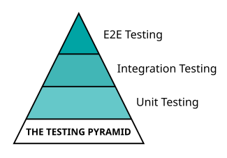

# Chapter 10: Testing and Deployment

## Introduction to Software Testing

Software testing is an indispensable part of the software development lifecycle. At its core, it's about finding bugs and inconsistencies in your software before your users do, but it's so much more than that. Let's embark on a journey to understand its importance and the different types of testing strategies that exist.

### Importance of Testing in Software Development

Testing ensures that the software meets its requirements and performs as expected in different scenarios. Here's why it's so essential:

1. **Reliability and Quality Assurance**: By uncovering bugs early, testing guarantees the software's reliability and stability. It's a quality assurance process that verifies whether the software behaves as expected, thus ensuring high customer satisfaction.

2. **Cost Effective**: The earlier a bug is found, the cheaper it is to fix. Discovering a bug after deployment could mean considerable expenditure in terms of time and resources, especially if it's a critical bug affecting many users.

3. **Performance Verification**: Testing not only verifies functional correctness but also the performance of your software under different conditions, ensuring that it can handle the intended load and operate within acceptable parameters.

4. **User Experience**: Testing enables you to experience the software from a user's perspective, ensuring it's user-friendly and meets user expectations.

### Overview of Different Types of Testing: Unit, Integration, and End-to-End (E2E) Testing

In software development, various types of tests correspond to different levels of your application. The three most commonly used types of tests are:

1. **Unit Testing**: This type of test is used to check individual components (like functions or classes) in isolation from the rest of the software system. It's the first level of testing and focuses on the smallest testable parts of the code.

2. **Integration Testing**: As the name suggests, integration testing is about combining individual software modules and testing them as a group. This test helps to expose defects in the interactions between different modules of the application.

3. **End-to-End (E2E) Testing**: This is the highest level of testing, validating the entire software system from start to finish. It verifies that the system works in harmony from end to end, replicating a user's interaction with the application.

### The Testing Pyramid: A Strategy for Test Allocation

The Testing Pyramid, first introduced by Mike Cohn, is a strategy that helps us visualize how to balance our testing efforts. Here's a simplified illustration:



At the base of the pyramid is *unit testing*. As unit tests are small, isolated, and quick to execute, we should have a large number of these.

The middle tier represents *integration tests*, which should be less in number than unit tests due to their larger scope and higher execution time.

At the top is *end-to-end testing*. As these tests span the entire application and are the slowest to execute, we should have the fewest of these.

This structure suggests a healthy balance of testing, with the bulk of tests being small and fast unit tests, and fewer, slower, and more expensive tests as you climb the pyramid.

In the following sections, we'll take a closer look at these testing types, how to perform them in a JavaScript environment, and how they contribute to your application's reliability and stability.

## Unit Testing

Unit testing forms the base of our testing pyramid. It focuses on validating the functionality of isolated pieces of code, such as individual functions or methods. By verifying these small parts in isolation, we can ensure that each part is correctly doing what it's supposed to do.

### Understanding Unit Testing and its Importance

Unit tests are designed to test a specific functionality in the code, and they should be completely isolated from other tests or dependencies. This isolation ensures that each test can be developed and run independently, making them fast and reliable.

The primary benefits of unit testing are:

1. **Identifying Bugs Early**: Since unit tests are typically written alongside the code or even before (in case of Test-Driven Development), they can catch issues and bugs early in the development cycle.

2. **Facilitating Changes and Simplifying Integration**: With a robust suite of unit tests, developers can make changes to their codebase with more confidence, knowing that they'll catch any potential regression errors (reappearance of previously fixed defects).

3. **Improving Design**: The need to make the code testable often leads to more modular, flexible code structures.

### Writing Unit Tests with Jest and Mocha

Two popular testing frameworks for JavaScript are Jest and Mocha. Let's look at an example of how we can write unit tests using Jest.

Suppose we have a simple function add in a file `math.js`:

```javascript
function add(x, y) {
  return x + y;
}

export default add;
```

We can write a unit test for this `add()` function in a file called `math.test.js` like so:

```javascript
import add from './math.js';

test('adds 1 + 2 to equal 3', () => {
  expect(add(1, 2)).toBe(3);
});
```

In the test above, we use the `test()` function provided by Jest to define a test. The first argument to `test()` is a string describing what the test is about. The second argument is a function that contains the actual testing code. Inside the test function, we use `expect()` and `toBe()` to assert that the add function returns the expected output `3` when given the input `1`, `2`.

### Mocking and Stubbing Dependencies

When unit testing, we often want to isolate the code we're testing from its dependencies. This isolation can be achieved through "mocking" and "stubbing".

A *mock* is a dummy object that mimics the behavior of a real object, while a stub is a function that replaces another function for the purpose of controlling a method's behavior during a test.

For example, suppose we have a function `getUserName()` that calls a function `fetchFromDatabase()` in file `user.js`:

```javascript
import { fetchFromDatabase } from './database.js';

export async function getUserName(userId) {
  const user = await fetchFromDatabase(userId);
  return user.name;
}
```

To be able to run the test, we need a minimal `database.js` implementation, which in a real project would access a database server:

```javascript
export async function fetchFromDatabase(userId){
  return { name: "Jane Doe" }; 
}

export function getNumberOfUsers() {
  return 100;
}
```

We could stub the `fetchFromDatabase()` function to control its behavior during a test (in file `user.test.js`):

```javascript
import { jest } from '@jest/globals';

jest.unstable_mockModule('./database.js', () => ({
  fetchFromDatabase: jest.fn().mockResolvedValue({ name: 'John Doe' }),
  getNumberOfUsers: jest.fn(() => 1),
}));

const { fetchFromDatabase, getNumberOfUsers } = await import('./database.js');
const { getUserName } = await import('./user.js');

test('getUserName returns correct name', async () => {
  const userName = await getUserName(1);
  expect(userName).toBe('John Doe');
});

test('getNumberOfUsers returns correct number', async () => {
  const numberOfUsers = getNumberOfUsers();
  expect(numberOfUsers).toBe(1);
});
```

We first need to import the Jest framework, and then due to the way Jest rewrites our test code, further imports must be performed with `const { ...} = await import('...');` (this may be subject to future change).

In the test above, we use Jest's `mock()` function to replace `fetchFromDatabase()` with a function that always returns a promise resolving to `{ name: 'John Doe' }`. The mocked function `getNumberOfUsers()` simply returns the number `1`, being defined by an arrow function within `jest.fn()`. Note that at the time of writing, Jest's support for ESM was "experimental" and so subject to breaking changes.

### Code Coverage and What it Means

Code coverage is a metric that helps us measure the extent of our codebase that's covered by our unit tests. In other words, it answers the question: "What proportion of our code is tested?"

While a high coverage is good, it's important to understand that 100% coverage doesn't guarantee a bug-free application. However, it does reduce the risk of bugs going unnoticed.

Jest comes with built-in support for generating code coverage reports. To generate a coverage report, we can add a `--coverage` flag when running Jest:

```bash
npx jest --coverage
```

This command will generate a coverage report in the console, as well as detailed HTML report in a `coverage/` directory at the root of your project.

In the next section, we'll discuss integration testing, which is the next level of testing where we test interactions between multiple units of our application.

## Integration Testing

While unit testing focuses on the smallest testable parts of the code, integration testing takes it a step further. This type of testing aims to uncover faults in the interaction between integrated units.

### Understanding Integration Testing and its Importance

Integration testing comes into play once all the units of a system are tested and ready. It aims to expose issues that may arise when different components of a software interact with each other.

Benefits of integration testing include:

1. **Detect Interaction Issues**: Integration testing helps to find errors that occur when different modules or components interact. These could be data inconsistencies, communication issues, or even failures in the service interfaces.

2. **System Cohesion**: It ensures that all individual components of a software can work together as a complete system. This contributes to the overall cohesion of the system.

3. **Risk Mitigation**: It mitigates the risk of faults and failures in a live environment by testing the components in a controlled environment first.

### Writing Integration Tests: Testing API Endpoints, Database Operations

Mocha and Chai are popular testing frameworks for Node.js applications. Mocha provides a flexible test runner with built-in support for asynchronous testing, allowing you to write test cases using various styles (e.g., BDD, TDD). Chai, on the other hand, is an assertion library that provides a readable and expressive syntax for making assertions in your tests. It offers multiple assertion styles (e.g., expect, assert, should) to suit different preferences. Together, Mocha and Chai provide a powerful combination for structuring and writing tests in Node.js.

First we need to install them for our project as developement dependencies:

```bash
npm install --save-dev mocha chai
```

Let's consider an example where we are testing an API endpoint using the `supertest` module along with Mocha. Here is a server `app.js` adapted from chapter 6:

```javascript
import express from 'express';
import path from 'path';

const app = express();
const port = 3000;

app.get('/', (req, res) => {
  res.send('Hello, Express!');
});

app.use(express.json());

app.get('/users', (req, res) => {
  res.send([{ id: 1, name: 'John Doe' }]);
});

if (process.env.npm_command !== 'test') {
  app.listen(port, () => {
    console.log(`App listening at http://localhost:${port}/`);
  });
}

export default app;
```

Note that we export the `app` object, and only invoke `app.listen()` if not running `npm test`. This is so our test harness can access our app, and ensure that the test invocation does not hang on completion of our tests.

Now create a file called `app.test.js` within a sub-directory called `test`:

```javascript
import app from '../app.js';
import request from 'supertest';
import chai from 'chai';
const expect = chai.expect;

describe('GET /users', () => {
  it('should return all users', async () => {
    const res = await request(app)
      .get('/users')
      .expect(200)
      .expect('Content-Type', /json/);
    
    expect(res.body).to.be.an('array');
    expect(res.body.length).to.be.above(0);
  });
});
```

In the code above, we make a GET request to the `/users` endpoint of our application and assert that it returns a 200 status code, the `Content-Type` header is set to a type of JSON, and the response body is a non-empty array.

Integration testing can also involve testing database operations to ensure they work as expected. For example, you could test that a `createUser()` function correctly adds a user to the database:

```javascript
import { createUser, getUser } from '../users.js';
import chai from 'chai';
const expect = chai.expect;

describe('createUser', () => {
  it('should create a user and retrieve it', async () => {
    const user = { name: 'John Doe', email: 'john@example.com' };
    await createUser(user);

    const retrievedUser = await getUser(user.email);
    expect(retrievedUser.name).to.equal(user.name);
    expect(retrievedUser.email).to.equal(user.email);
  });
});
```

In the test above, we call `createUser()` to add a user to the database and then call `getUser()` to retrieve the user. We assert that the retrieved user's name and email match the ones we added.

A dummy `users.js` with sufficient functionality to run this test could be:

```javascript
let allUsers = [];

export function createUser(user) {
  allUsers.push(user);
}

export function getUser(email) {
  return allUsers.filter((user) => user.email === email)[0];
}

export function clearUsers() {
  allUsers.length = 0;
}
```

### Managing Test Data for Integration Tests

Managing test data is a key part of integration testing. It's important to set up and tear down test data for each test to ensure that tests are isolated and repeatable.

You could use "before" and "after" hooks to manage your test data:

```javascript
import { createUser, getUser, clearUsers } from '../users.js';
import chai from 'chai';
const expect = chai.expect;

describe('users', () => {
  beforeEach(async () => {
    // Set up test data
    await createUser({ name: 'John Doe', email: 'john@example.com' });
  });

  afterEach(async () => {
    // Clear test data
    await clearUsers();
  });

  it('should always fetch a valid user', async () => {
    const retrievedUser = await getUser('john@example.com');
    expect(retrievedUser.name).to.equal('John Doe');
    expect(retrievedUser.email).to.equal('john@example.com');
  });
});
```

In the code above, we use the `beforeEach` hook to create a user before each test, and the `afterEach` hook to clear the users after each test. This way, we ensure that each test runs with the same initial data and that tests don't interfere with each other.

In the next section, we'll go a step further and discuss end-to-end testing, which tests a software system from start to finish.

## End-to-End Testing

End-to-End (E2E) testing is the process of testing the entire software from beginning to end to ensure that it works as expected under real-world scenarios. It goes beyond unit and integration testing by checking the complete system flow.

### Understanding End-to-End (E2E) Testing and its Importance

E2E testing simulates real user scenarios, ensuring that all interconnected components of the application are working together correctly from start to finish. It seeks to identify system dependencies and ensure that the right information is passed through the entire system.

Here are some key advantages of E2E testing:

1. **User Experience**: E2E testing helps verify that the system provides a smooth and satisfactory user experience.

2. **System Integration**: By testing the entire system as a whole, E2E testing confirms that all components are correctly integrated and functioning together as expected.

3. **Prevention of Bugs and Breakages**: As it mimics real user scenarios, E2E testing can identify bugs and breakages that might not have been caught during unit or integration testing.

### Writing E2E Tests with Tools like Cypress and Selenium

Cypress and Selenium are two popular tools for E2E testing in JavaScript. Let's look at an example of an E2E test with Cypress:

```javascript
describe('Todo App', () => {
  it('should navigate to the Todo App and add a new todo', () => {
    // Visit the Todo App
    cy.visit('http://localhost:3000');

    // Enter 'Feed the cat' into the input field and press enter
    cy.get('.todo-input')
      .type('Feed the cat{enter}');

    // The new todo should be visible in the list
    cy.get('.todo-list')
      .should('contain', 'Feed the cat');
  });
});
```

In this Cypress test, we simulate a user visiting our Todo App, entering a new todo item in the input field, and verifying that the new todo appears in the list.

### Setting Up Testing Environment for E2E Tests

A testing environment closely mimics the production environment but is designed for testing. It is crucial to set it up correctly to run E2E tests.

When setting up your testing environment, consider the following:

1. **Data Isolation**: Use a separate database for testing. This approach keeps your production data safe and allows you to manipulate your test data as needed without any repercussions.

2. **Configuration**: The configuration of your testing environment should closely mirror your production environment. This setup can help uncover issues that may occur in production.

3. **Automation**: Automating the setup and tear-down of your testing environment can make running tests quicker and easier. Tools like Docker can be very useful in this regard.

In the next section, we'll take a deeper look at Test-Driven Development, an approach that encourages writing tests before writing the code to be tested.

## Test-Driven Development (TDD)

Test-Driven Development (TDD) is a development methodology that flips the traditional development process on its head. Instead of writing code first and then tests, with TDD, you write the tests first and then the code.

### Introduction to TDD and its Advantages

TDD begins with developing a test for each functionality. Initially, all tests will fail because there is no code implemented. Then, developers write the minimal code required to pass the test. The process repeats with additional tests, each helping to construct the final software.

Some key advantages of TDD are:

1. **Reduced Bug Density**: By writing tests first, you can catch bugs early before they become a part of the codebase.

2. **Improved Code Design**: Since TDD focuses on writing just enough code to pass tests, it often leads to simpler and more modular code.

3. **Confidence in Refactoring**: If your code has a good test coverage, you can refactor with confidence, knowing that your tests will catch any regression errors.

### The Red-Green-Refactor Cycle of TDD

TDD follows a simple iterative process called the Red-Green-Refactor cycle:

1. **Red**: Write a failing test.
2. **Green**: Write just enough code to make the test pass.
3. **Refactor**: Clean up the code while ensuring that tests still pass.

This process helps maintain a tight feedback loop, with the developer continuously testing and improving their code.

### Applying TDD with Jest and Mocha

Now, let's see an example of applying TDD using Jest. Suppose we want to develop a multiply function. We'll start by writing a test for this function in file `math2.test.js`, together with an initially empty file `math2.js`:

```javascript
import multiply from './math2.js';

test('multiplies 2 * 3 to equal 6', () => {
  expect(multiply(2, 3)).toBe(6);
});
```

Running the test will fail because we have not defined the multiply function. This is the "Red" phase of the TDD cycle.

Next, we'll write just enough code in `math2.js` to make the test pass:

```javascript
function multiply(x, y) {
  return x * y;
}

module.exports = multiply;
```

If we run the tests now, they should pass. This is the "Green" phase.

Finally, we can refactor our code. For this simple example, there's not much to refactor, but in a more complex situation, this step might involve improving code readability, structure, or performance. The crucial point is that all tests should still pass after refactoring.

This cycle continues as we add more functionality, always starting with a test. In the next section, we will discuss how we can automate these tests using Continuous Integration (CI).

## Automating Tests with Continuous Integration (CI)

Continuous Integration (CI) is a development practice where developers integrate their code into a shared repository frequently, preferably several times a day. Each integration is then verified by an automated build and automated tests to detect integration errors as quickly as possible.

### Introduction to Continuous Integration and its Benefits

The central idea behind CI is to catch issues early in the development process, making them easier and quicker to fix. It relies heavily on test automation to quickly get feedback on the health of the new code.

Here are some of the benefits of CI:

1. **Quick Feedback**: CI provides quick feedback on whether the integrated code works as expected.

2. **Less Debugging**: Since CI involves integrating small changes frequently, it helps reduce the time spent on debugging.

3. **Reduced Risk**: By integrating and testing code often, you reduce the risk of serious integration issues.

### Setting Up a CI Pipeline with GitHub Actions, Jenkins

Setting up a CI pipeline involves creating a configuration file that describes the steps that need to occur when code is pushed to the repository.

For example, let's set up a CI pipeline using GitHub Actions for a Node.js application, in a file `.github/workflows/ci.yml`:

```yaml
name: Node.js CI

on:
  push:
    branches: [ main ]

jobs:
  build:

    runs-on: ubuntu-latest

    strategy:
      matrix:
        node-version: [18.x]

    steps:
    - uses: actions/checkout@v2
    - name: Use Node.js ${{ matrix.node-version }}
      uses: actions/setup-node@v1
      with:
        node-version: ${{ matrix.node-version }}
    - run: npm ci
    - run: npm test
```

In this GitHub Actions workflow:

* We're running the workflow whenever code is pushed to the main branch.
* We're using the latest Ubuntu environment and Node.js 18.x.
* The steps are to checkout the code, setup Node.js, install the dependencies, and then run the tests.

You can also set up CI pipelines with other tools like Jenkins, which provide more customization options but might be more complex to set up.

### Integrating Test Suite into the CI Pipeline

Integrating your test suite into the CI pipeline ensures that your tests run automatically whenever code is pushed.

In our GitHub Actions example above, we're running `npm test` to execute our test suite. If any of the tests fail, the workflow will fail, indicating an issue with the pushed code.

In the next section, we'll discuss deployment and hosting, the next steps after your code has been integrated and tested.

## Deployment and Hosting

Once your JavaScript application has been tested and integrated, the next step is to deploy it and make it available to users. Deployment involves packaging and installing the components of the application, configuring the environment, and starting the application.

### Understanding Deployment Process and Hosting Options

The deployment process can vary depending on the nature of the application and the hosting environment. For a typical fullstack JavaScript application, the process might include:

* **Building the Application**: This may involve transpiling TypeScript/JSX code to JavaScript, bundling and minifying other JavaScript files, and compiling SCSS or Less files to CSS.

* **Packaging the Application**: The application and its dependencies might need to be packaged for deployment.

* **Deploying the Application**: The packaged application is then transferred to the hosting environment.

* **Configuring the Environment**: This includes setting environment variables, configuring database connections, etc.

* **Starting the Application**: Finally, the application is started, often with a process manager like PM2.

For hosting a fullstack JavaScript application, you have several options, including traditional web hosts, cloud services like AWS, Azure, Google Cloud, and platforms as a service (PaaS) like Heroku and Netlify.

### Deploying Applications on Heroku, Netlify, and AWS

Let's briefly go over how to deploy a Node.js application on Heroku:

1. **Initialize a Git Repository**: If you haven't already, initialize a Git repository in your project folder with `git init`.

2. **Create a Heroku App**: Create a new app on Heroku either through the Heroku Dashboard or using the Heroku CLI command heroku create.

3. **Commit Your Changes**: Make sure all your changes are committed to the Git repository.

4. **Push to Heroku**: Push your application to Heroku with `git push heroku main`.

To deploy a static website on Netlify, you can simply drag and drop your site folder on the Netlify dashboard, or you can link a GitHub repository, and Netlify will automatically build and deploy your site when you push to your repository.

Deploying on AWS might involve more steps, depending on the service you use. AWS offers a variety of services like EC2 for running servers, S3 for storage, and Elastic Beanstalk as a PaaS solution.

### Understanding and Managing Environment Variables

Environment variables are often used to store configuration settings that vary between environments. For example, you might have a different database connection string for your development and production environments.

In Node.js, you can use the `process.env` object to access environment variables. For example, `process.env.DB_CONNECTION_STRING` would give you the database connection string.

However, it's not a good practice to store your environment variables in your code repository for security reasons. Instead, you can store them in a `.env` file in your local environment, and use a package like `dotenv` to load them into `process.env`. On your hosting environment, you can usually set environment variables through the dashboard or CLI.

In the next section, we'll progress into Continuous Deployment and Continuous Delivery (CD), which can help automate the deployment process.

## Continuous Deployment and Delivery (CD)

In the realm of software development, Continuous Deployment and Continuous Delivery (CD) are practices that automate the delivery of software to production. While closely related, they have a subtle distinction.

### Introduction to Continuous Deployment and Continuous Delivery

*Continuous Delivery* is a practice where code changes are automatically built, tested, and prepared for a release to production. It ensures that your software is always in a release-ready state.

*Continuous Deployment* goes a step further by automatically deploying every change that passes the automated tests. It eliminates the need for manual intervention in the deployment process.

By incorporating CD into your development process, you ensure that new features, updates, and bug fixes reach your users as quickly as possible. This enables a quicker feedback loop and a more responsive development process.

### Building a CD Pipeline: Automated Build, Test, and Deployment

A CD pipeline automates the steps of building, testing, and deploying your application. Here's a basic example of what a CD pipeline might look like:

1. **Commit**: Developers commit changes to the shared repository.
2. **Build**: The application is automatically built. This may involve compiling code, downloading dependencies, etc.
3. **Test**: Automated tests are run against the build.
4. **Deploy**: If the tests pass, the application is automatically deployed to the production environment.

Note that the deployment step distinguishes Continuous Deployment from Continuous Delivery. In Continuous Delivery, the deployment might require manual approval.

### CD with GitHub Actions, Jenkins, CircleCI

You can implement a CD pipeline using various tools. Let's see an example `.github/workflows/cd.yml` using GitHub Actions to deploy a Node.js application to Heroku:

```yaml
name: Node.js CD

on:
  push:
    branches: [ main ]

jobs:
  build-and-deploy:

    runs-on: ubuntu-latest

    strategy:
      matrix:
        node-version: [18.x]

    steps:
    - uses: actions/checkout@v2
    - name: Use Node.js ${{ matrix.node-version }}
      uses: actions/setup-node@v1
      with:
        node-version: ${{ matrix.node-version }}
    - run: npm ci
    - run: npm test
    - name: Deploy to Heroku
      uses: akhileshns/heroku-deploy@v3.12.12
      with:
        heroku_api_key: ${{secrets.HEROKU_API_KEY}}
        heroku_app_name: "your-heroku-app-name"
        heroku_email: "your-email@example.com"
```

This workflow automatically deploys your application to Heroku whenever you push to the main branch. Note that you need to replace `"your-heroku-app-name"` and `"your-email@example.com"` with your actual Heroku app name and email.

Other tools like Jenkins and CircleCI can provide more customization options but might require more setup.

Next, we'll look at monitoring and error tracking, which are essential for maintaining the health and performance of your application once it's deployed.

## Performance Monitoring and Error Tracking

Once your application is deployed and accessible to users, it's crucial to keep track of its performance and quickly address any issues that arise. This is where performance monitoring and error tracking come into play.

### Monitoring Application Performance with Tools like New Relic, Datadog

Application Performance Monitoring (APM) tools allow you to monitor and manage the performance and availability of your software applications. These tools provide real-time monitoring and deliver long-term trends in web application and infrastructure performance.

For instance, New Relic provides insights into how your fullstack application performs in production. It helps you trace transactions across tiers, capture browser page-load times, and analyze SQL and NoSQL performance.

Similarly, Datadog is a monitoring and analytics platform that can be used to see inside any stack, any app, at any scale, anywhere.

### Tracking and Managing Errors with Sentry, LogRocket

Error tracking tools are vital for identifying and addressing issues in your application. They capture errors in real-time, provide detailed error reports, and often offer integration with issue tracking systems.

Sentry, for instance, provides real-time error tracking that gives you insight into production deployments and information to reproduce and fix crashes.

On the other hand, LogRocket is a frontend logging tool that lets you replay problems as if they happened in your own browser. It also tracks user engagement and monitors performance.

### Importance of Logging and Centralized Log Management

Logs provide invaluable insights into what's happening in your application. They record system activity and can help identify problems and understand the state of the system when those problems occurred.

A centralized log management system collects logs from various sources and provides tools for searching and analyzing them. This can be especially useful in a microservices architecture where logs might be generated by many different services.

In Node.js, you might use a logging library like Winston or Bunyan to generate logs. These logs can then be collected and analyzed using a tool like Logstash or Graylog.

```javascript
import winston from 'winston';

const logger = winston.createLogger({
  level: 'info',
  format: winston.format.json(),
  transports: [
    new winston.transports.File({ filename: 'error.log', level: 'error' }),
    new winston.transports.File({ filename: 'combined.log' }),
  ],
});

logger.error('This is an error log');
logger.info('This is an info log');
```

This would generate logs in the specified files, which can be collected and analyzed.

In the next section, we will discuss best practices in testing and deployment to ensure your application is reliable, maintainable, and delivers a high-quality user experience.

## Best Practices in Testing and Deployment

Understanding and implementing testing and deployment is a significant milestone. Still, to ensure your application's quality and maintainability, adhering to best practices is crucial.

### Importance of a Testing Culture and Mindset

Cultivating a testing culture is one of the most important practices. Testing shouldn't be an afterthought or solely the responsibility of a separate team. Instead, it should be part of the development process from the start and a responsibility shared by all developers. This testing mindset can lead to more robust code, faster development cycles, and ultimately, a better product.

### Strategies for Effective Test Case Writing

Writing effective test cases is key to comprehensive testing. Here are some strategies:

1. **Write Clear, Concise Test Cases**: Each test case should test one thing and have a clear, descriptive name.
2. **Follow the Arrange-Act-Assert (AAA) Pattern**: Arrange your objects, act on those objects, and then assert the results.
3. **Test the Common Case and the Edge Cases**: Don't just test the "happy path"; be sure to test possible edge cases too.
4. **Use Mocks and Stubs Appropriately**: Mocks and stubs can isolate your test case and help test difficult scenarios, but don't overuse them.

Here's an example of a clear, concise test case following the AAA pattern:

```javascript
describe('User', () => {
  it('should be able to register with a valid email and password', async () => {
    // Arrange
    const user = new User();
    
    // Act
    const result = await user.register('test@example.com', 'strongpassword');
    
    // Assert
    expect(result.success).toBe(true);
  });
});
```

### Deployment Checklist: Pre and Post-deployment Considerations

Before deploying, have a checklist to ensure a smooth process:

1. **All Tests Pass**: Ensure that all unit, integration, and E2E tests pass.
2. **Code Review and Quality**: Have your code reviewed by a peer and ensure it adheres to your team's coding standards.
3. **Check Dependencies**: All dependencies should be up-to-date and secure.
4. **Backup**: Always have a backup of your data before a deployment, especially when database migrations are involved.
5. **Monitor Performance**: Have a monitoring system in place to catch any issues.

After deployment:

1. **Verify the Deployment**: Check that the application is running correctly and accessible to users.
2. **Monitor**: Keep an eye on the metrics, logs, and error reporting tools to catch any unexpected issues.
3. **Rollback Plan**: If something goes wrong, you should have a plan to quickly roll back the deployment.

Following these best practices in testing and deployment will not only ensure the reliability and quality of your software but also make the development process more efficient and enjoyable. Always remember that these are iterative processes and you should keep refining them as your application and team grow.
