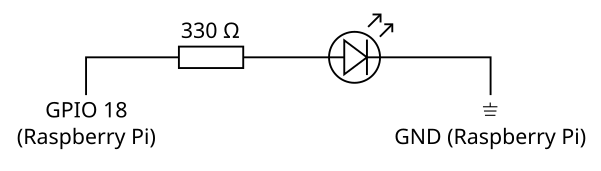
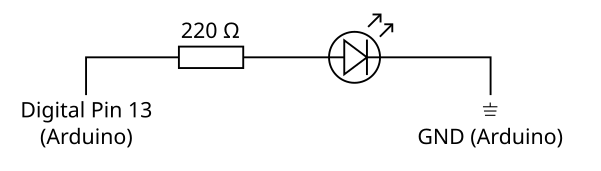

# Chapter 28: Building IoT Applications with JavaScript

## Introduction to IoT and Its Applications

The Internet of Things (IoT) has emerged as a transformative force, shaping the future of technology. It's a vast and somewhat abstract concept, one that's sometimes hard to pin down for those who aren't actively involved in the tech industry. Let's break down the key components of IoT to fully understand this revolutionary phenomenon.

### Defining the Internet of Things (IoT)

In simple terms, the Internet of Things (IoT) describes a network of physical objects&nbsp;&mdash;&nbsp;"things"&nbsp;&mdash;&nbsp;that are embedded with sensors, software, and other technologies to connect and exchange data with other devices and systems over the internet. These devices range from ordinary household objects like refrigerators and thermostats to industrial tools such as machinery in factories.

But the magic of IoT isn't simply about devices being connected to the internet; it's about the data these devices collect, how they interpret it, and what they do with this information. This capability unlocks a whole new world of possibilities, influencing sectors as diverse as healthcare, agriculture, manufacturing, and home automation.

### Overview of IoT Use Cases and Applications Across Industries

There's virtually no limit to what IoT can accomplish, which is why its application is so extensive across different industries:

* **Agriculture**: IoT-enabled devices help monitor crop conditions and automate farming practices.
* **Manufacturing**: IoT streamlines manufacturing processes, enhancing productivity and minimizing waste.
* **Healthcare**: IoT devices monitor patients' vitals in real-time and help manage medication intake.
* **Home Automation**: IoT has made homes smarter with devices that control lighting, heating, and security remotely.

### Understanding the IoT Ecosystem: Devices, Connectivity, Data Processing, and User Interface

The IoT ecosystem is a complex network that consists of:

* **Devices**: Physical objects embedded with sensors to collect data.
* **Connectivity**: Once the data is collected, it is sent to the cloud, usually via some form of wireless connectivity.
* **Data Processing**: Once the data arrives in the cloud, software processes it to extract useful insights.
* **User Interface**: The information is then made available to the end-user in a usable way.

These four stages form the foundation of any IoT system and they all work in concert to turn raw data into valuable action.

### Role of JavaScript in IoT Development

While languages like C and Python have traditionally dominated the IoT landscape, JavaScript's ubiquity and simplicity make it a viable choice for IoT development. JavaScript, primarily known as a front-end development language, can be used for back-end development with Node.js. It allows for event-driven, non-blocking I/O operations that are perfect for IoT devices that require real-time data exchange.

Several JavaScript libraries and frameworks have been developed to interface directly with IoT devices. Libraries like Johnny-Five provide JavaScript API for low-level hardware programming, and platforms like Node-RED offer a flow-based JavaScript development tool for IoT.

To sum up, JavaScript offers a unified language for complete IoT application development&nbsp;&mdash;&nbsp;from the device to the cloud and to the user interface.

In the following sections, we'll uncover the details of how we can use JavaScript to create IoT applications with popular hardware like Raspberry Pi and Arduino, communicate with these devices, integrate them with web applications, and ensure their security. Along the way, we'll also discuss the future of IoT and some of the ethical and legal implications that come with it.

## Building IoT Applications with Raspberry Pi and Arduino

The physical cornerstones of any IoT system are the devices themselves. Two popular choices among hobbyists and professionals alike are Raspberry Pi and Arduino, largely due to their accessibility and extensive communities. Let's explore how we can use JavaScript to interact with these devices.

### Introduction to Raspberry Pi: Overview, Operating System, and Programming with JavaScript

Raspberry Pi is a series of small, affordable, single-board computers that you can use to learn programming and build IoT devices. The OS of choice for Raspberry Pi is often a version of Linux, such as Raspbian.

While Python is the most commonly used language with Raspberry Pi, JavaScript is a viable alternative thanks to Node.js, an open-source, cross-platform, JavaScript runtime environment that executes JavaScript code outside a web browser.

To start, you'll need to install Node.js on your Raspberry Pi:

```bash
sudo apt-get update
sudo apt-get upgrade
wget -qO- https://deb.nodesource.com/setup_18.x | sudo -E bash -
sudo apt-get install -y nodejs
```

This installs Node.js and npm, the default package manager for Node.js.

### Creating a Simple IoT Device with Raspberry Pi and Node.js

Let's create a simple IoT device: a LED light controller. For this, you'll need a Raspberry Pi, a breadboard, a LED, a 330-ohm resistor, and some jumper wires.

Here's a simple circuit diagram to get you started:



We will use the onoff npm package to interact with the GPIO (General Purpose Input/Output) pins of the Raspberry Pi. Install it using the following command:

```bash
npm install onoff
```

Then, create a file called `blink.js`:

```javascript
import onoff from 'onoff';
const Gpio = onoff.Gpio;
const LED = new Gpio(18, 'out');

setInterval(() => {
  let value = LED.readSync() ^ 1; // Use XOR to flip the value
  LED.writeSync(value);
}, 500);
```

Run the script:

```bash
node blink.js
```

The LED should now be blinking every 500ms.

### Introduction to Arduino: Overview and Programming with JavaScript

Arduino is an open-source electronics platform based on easy-to-use hardware and software. Unlike Raspberry Pi, which is a single-board computer, Arduino is a microcontroller&nbsp;&mdash;&nbsp;it's less powerful but uses less energy and is perfect for simpler tasks that run repetitively.

While Arduino doesn't natively support JavaScript, we can interact with it using the Johnny-Five library, a JavaScript Robotics & IoT platform.

To start, install Node.js on your computer, then install Johnny-Five:

```bash
npm install johnny-five
```

### Building an IoT Device with Arduino and Johnny-Five JavaScript Framework

We'll create a simple Arduino IoT device: an LED blinker. You'll need an Arduino Uno board, a LED, a 220-ohm resistor, and some jumper wires.

Here's a simple circuit diagram:



Before writing JavaScript code, you need to install a program called "Standard Firmata" on your Arduino, which allows Johnny-Five to communicate with the Arduino over a serial port. Open the Arduino IDE, go to File > Examples > Firmata > StandardFirmata, and upload it to the Arduino board.

Now create a file called `blink.js`:

```javascript
import five from "johnny-five";
const board = new five.Board();

board.on("ready", () => {
  const led = new five.Led(13);
  led.blink(500);
});
```

Run the script with the Arduino plugged into your computer:

```bash
node blink.js
```

The LED should now be blinking every 500ms, just like with the Raspberry Pi.

These examples are quite basic, but they illustrate how JavaScript can be used to interact with IoT devices. In the next sections, we'll expand on these ideas to create more complex systems, communicate with these devices, and integrate them with web applications.

## Communicating with IoT Devices

IoT devices are designed to communicate&nbsp;&mdash;&nbsp;with each other, with the cloud, and with applications. They do this through a variety of protocols, each suited to different types of communication and different types of devices. JavaScript, through the use of libraries and modules, is well-suited to working with these protocols.

### Understanding Different IoT Communication Protocols: HTTP, MQTT, WebSocket, etc.

There are several protocols often used with IoT devices:

* **HTTP**: This is the same protocol used for most web communication. It's simple, but it's not always the most efficient for IoT, as it can use a lot of bandwidth.

* **MQTT**: This is a lightweight messaging protocol designed for low-bandwidth, high-latency networks. It's ideal for many IoT devices, especially those on battery power or limited network connections.

* **WebSocket**: This protocol allows for full-duplex communication between a client and server, which makes it great for real-time data updates.

### Implementing Communication in JavaScript with IoT Devices using Various Protocols

Let's consider how to implement these protocols in JavaScript for communication with our IoT devices.

### HTTP Communication

A simple way to enable HTTP communication is by creating an HTTP server on the Raspberry Pi or Arduino. For Raspberry Pi this can be achieved using Node.js and Express.js as for a typical desktop computer acting as a server.

On Arduino, the method is board-specific, but can be achieved with boards which have an Ethernet shield or WiFi-capable radio microprocessor. Be aware that creating an HTTP server for Arduino is a somewhat manual task, and creating routes and HTTP responses will need to be achieved in C++ code.

### MQTT Communication

MQTT communication requires an MQTT broker to relay messages between devices. For JavaScript on Raspberry Pi, we can use the mqtt package. Here's an example of how to publish messages:

```bash
npm install mqtt
```

```javascript
import mqtt from 'mqtt';
const client  = mqtt.connect('mqtt://test.mosquitto.org'); // public test broker

client.on('connect', () => {
  setInterval(() => {
    client.publish('myTopic', 'Hello mqtt');
    console.log('Message Sent');
  }, 5000);
});
```

Here, we're sending a message "Hello mqtt" every 5 seconds to the topic myTopic.

### WebSocket Communication

Socket.IO is a popular library for WebSocket communication, which we discussed in chapter 13. To start a Socket.IO server on the Raspberry Pi, use:

```javascript
import express from 'express';
import http from 'http';
import socket from 'socket.io';

const app = express();
const httpserver = http.createServer(app);
const io = socket(httpserver);
const port = 3000;

io.on('connection', (socket) => {
  console.log('a user connected');
});

httpserver.listen(port, () => {
  console.log(`listening on *:${port}`);
});
```

This sets up a server that listens for WebSocket connections on port 3000.

These examples demonstrate the basics of communication with IoT devices using JavaScript. In the real world, you'll need to consider many other factors such as security, error handling, and connecting to cloud services. We'll cover these topics in the upcoming sections.

## Connecting IoT Devices to the Cloud with AWS IoT and Azure IoT

Cloud platforms like AWS IoT and Azure IoT offer comprehensive solutions to manage IoT applications. They provide a multitude of services, such as device connectivity, data storage, processing, analytics, and security. In this section, we'll explore how to connect our devices to these platforms using JavaScript.

### Introduction to Cloud IoT Platforms: Overview of AWS IoT and Azure IoT

AWS IoT and Azure IoT are feature-rich platforms that support a wide range of IoT needs. They provide services for device connectivity, data processing, machine learning, and security among others.

AWS IoT Core is the managed cloud platform that lets connected devices interact with cloud applications and other devices. Azure IoT Hub is Microsoft's offering for managing and communicating with IoT devices.

### Connecting an IoT Device to AWS IoT Core: Registration, Security, and Communication

To connect an IoT device to AWS IoT, we need to follow these steps:

1. Register the device in the AWS IoT Core.
2. Create and attach a policy to the device for security.
3. Use AWS IoT Device SDK for JavaScript to communicate with the device.

After registering the device and attaching a policy in the AWS IoT console, we can use the AWS SDK to communicate with the device. Here is an example:

```javascript
import awsIot from 'aws-iot-device-sdk';

const device = awsIot.device({
   keyPath: 'private.pem.key',
  certPath: 'certificate.pem.crt',
    caPath: 'root-CA.crt',
  clientId: 'myAwsClientId',
      host: 'data.iot.<region>.amazonaws.com'
});

device
  .on('connect', () => {
    console.log('Connected to AWS IoT');
    device.publish('topic_1', JSON.stringify({ test_data: 1}));
});
```

This code connects to AWS IoT Core and publishes a message to `topic_1` topic.

### Connecting an IoT Device to Azure IoT Hub: Device Provisioning, Message Routing, and Communication

To connect an IoT device to Azure IoT, we follow these steps:

1. Register the device with the IoT hub using Azure Portal or Azure CLI.
2. Install Azure IoT device SDK for Node.js.
3. Communicate with the device.

Once the device is registered, we can use Azure IoT Device SDK to communicate with the device. Here is an example:

```bash
npm install azure-iot-device-mqtt
```

```javascript
import { clientFromConnectionString } from 'azure-iot-device-mqtt';
import { Message } from 'azure-iot-device';

const connectionString = 'HostName=<my-host-name>;DeviceId=<my-device-id>;SharedAccessKey=<my-shared-access-key>';

const client = clientFromConnectionString(connectionString);

const connectCallback = (err) => {
  if (err) {
    console.error('Could not connect: ' + err.message);
  } else {
    console.log('Connected to Azure IoT Hub');
    const message = new Message('Hello Azure');
    client.sendEvent(message, (err) => {
      if (err) console.error(err.toString());
    });
  }
};

client.open(connectCallback);
```

This code connects to Azure IoT Hub and sends a "Hello Azure" message.

### Comparing AWS IoT and Azure IoT: Pros, Cons, and Use Cases

Both AWS IoT and Azure IoT offer robust solutions for managing IoT applications, but they do have slight differences:

* AWS IoT offers better integration with other AWS services, such as Lambda for serverless computing and Kinesis for real-time data streaming.
* Azure IoT offers strong integration with Microsoft's enterprise applications and services, such as Dynamics 365 and Power BI.

The best choice depends on the specific requirements of your project and the ecosystem you're most comfortable with.

Connecting your IoT devices to a cloud platform allows you to easily manage, process, and analyze the data they produce. It also opens up possibilities for more advanced features, like machine learning and real-time analytics, which we'll explore in later chapters.

## Integrating IoT with Web Applications

IoT devices don't exist in isolation. They're often integrated with web applications to provide real-time data updates, remote control, and much more. In this section, we'll cover the basics of connecting IoT devices with web applications using JavaScript.

### Designing the Architecture for an IoT-Enabled Web Application

When integrating an IoT system with a web application, you will need to plan the system architecture carefully. The system will typically include the IoT devices, a cloud service for data processing and storage, and a front-end web application for user interaction.

The web application will communicate with the cloud service to send commands to the devices and receive data updates. The cloud service acts as a mediator between the devices and the web application, ensuring secure and reliable communication.

### Creating a Real-Time Data Dashboard with JavaScript

A common use case for IoT devices is to feed data into a real-time dashboard. For this purpose, we'll use Socket.IO and Express.js to create a simple dashboard for our devices.

First, we need to set up a Socket.IO server that our devices will connect to:

```javascript
import express from 'express';
import http from 'http';
import socket from 'socket.io';

const app = express();
const httpserver = http.createServer(app);
const io = socket(httpserver);
const port = 3000;

io.on('connection', (socket) => {
  console.log('Device connected');
});

httpserver.listen(port, () => {
  console.log(`listening on *:${port}`);
});
```

Then, in the IoT device's code, we connect to the Socket.IO server and emit data:

```javascript
import io from 'socket.io-client';
const socket = io('http://localhost:3000');

setInterval(() => {
  const data = // gather your data here
  socket.emit('data', data);
}, 1000);
```

In the web application, we use Socket.IO's client library to connect to the server and listen for data:

```javascript
const socket = io('http://localhost:3000');

socket.on('data', (data) => {
  // Update the dashboard with the new data
});
```

### Making IoT Data Available to Web Applications via APIs

In some cases, you might want to make the IoT data available to web applications via an API. Express.js can be used to easily create a REST API:

```javascript
import express from 'express';
const app = express();
const port = 3000;

let data = {};

app.get('/data', (req, res) => {
  res.send(data);
});

app.listen(port, () => {
  console.log(`Server listening at http://localhost:${port}`);
});
```

### Implementing Real-Time Communication between IoT Devices and Web Applications using WebSockets and MQTT over WebSockets

WebSockets and MQTT over WebSockets are great technologies for implementing real-time communication between IoT devices and web applications. MQTT over WebSockets combines the lightweight publish/subscribe messaging of MQTT with the real-time capabilities of WebSockets.

Here's an example of a client subscribing to a topic with MQTT over WebSockets using the mqtt library:

```javascript
import mqtt from 'mqtt';
const client = mqtt.connect('wss://broker.example.com:9001');

client.on('connect', () => {
  client.subscribe('myTopic', (err) => {
    if (!err) {
      console.log('Subscribed to myTopic');
    }
  });
});

client.on('message', (topic, message) => {
  // message is a Buffer
  console.log(message.toString());
});
```

This way, our web application can listen for updates from our IoT devices in real time.

These examples give you a glimpse of the potential of integrating IoT devices with web applications. They provide a solid foundation, but there's so much more to explore and implement. As you uncover the world of IoT, you'll come across new patterns, technologies, and architectures that will broaden your perspective.
